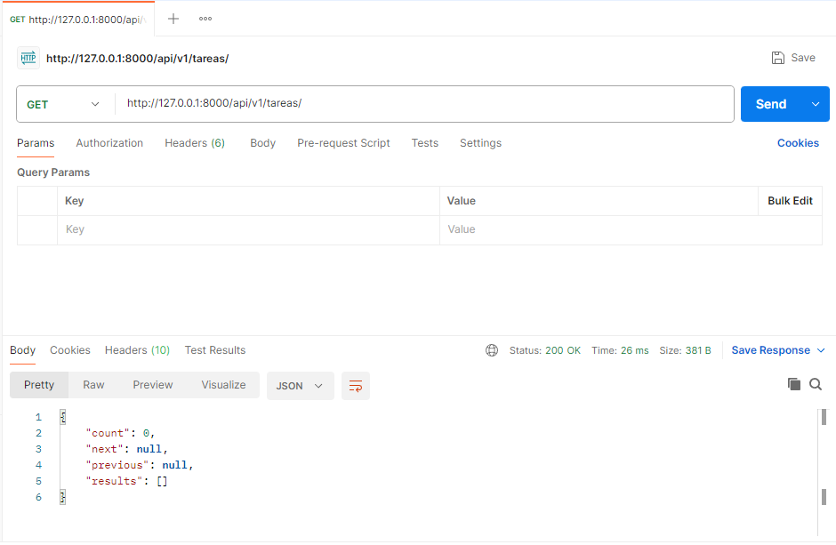
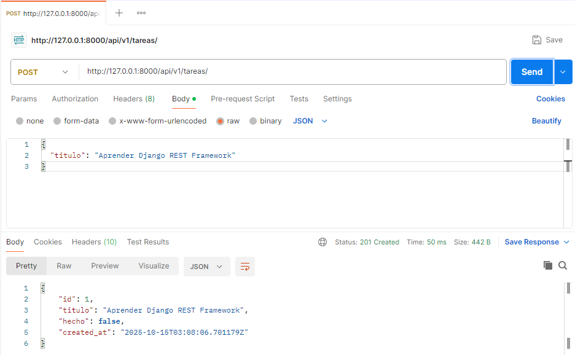
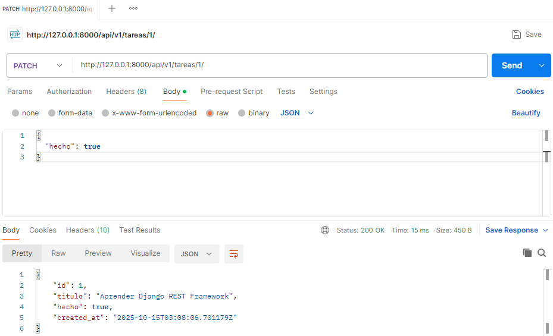
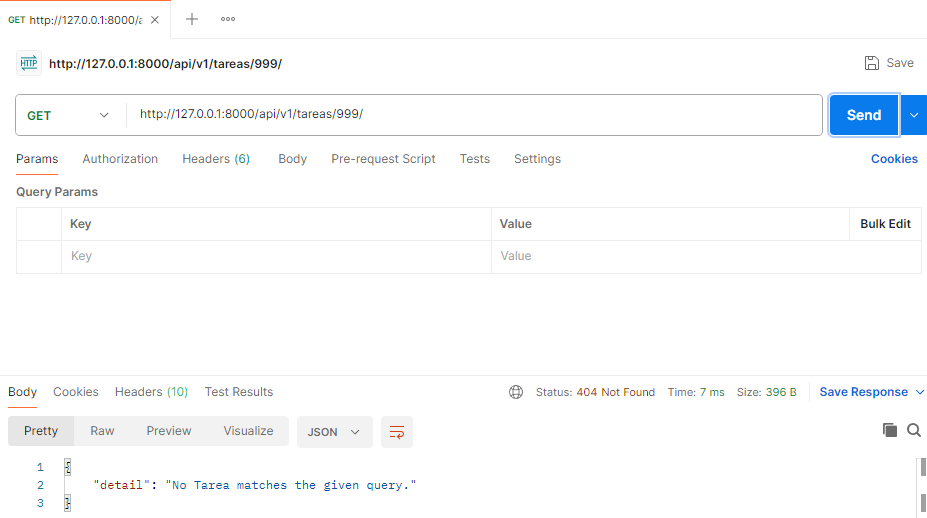

# Pruebas de la API con Postman

En este archivo se documentan las pruebas de la API REST `/api/v1/tareas/` utilizando **Postman**.

Cada punto incluye la descripción de la prueba y el espacio para adjuntar un **pantallazo**.

---

## 1️⃣ Listar todas las tareas

**Método:** GET

**Endpoint:** `http://127.0.0.1:8000/api/v1/tareas/`

**Resultado esperado:** Código **200 OK**, devuelve lista JSON.

📸 *Pantallazo 1: Lista de tareas (GET /tareas)*

---

## 2️⃣ Crear una nueva tarea

**Método:** POST

**Endpoint:** `http://127.0.0.1:8000/api/v1/tareas/`

**Resultado esperado:** Código **201 Created**, devuelve la tarea creada.

📸 *Pantallazo 2: Creación de tarea (POST /tareas)*

---

## 3️⃣ Obtener detalle de una tarea

**Método:** GET

**Endpoint:** `http://127.0.0.1:8000/api/v1/tareas/1/`

**Resultado esperado:** Código **200 OK**, devuelve los campos de la tarea.

📸 *Pantallazo 3: Detalle de tarea (GET /tareas/{id})*

---

## 4️⃣ Actualizar estado “hecho”

**Método:** PATCH

**Endpoint:** `http://127.0.0.1:8000/api/v1/tareas/1/`

**Resultado esperado:** Código **200 OK**, campo **hecho** cambiado a **true**.

📸 *Pantallazo 4: Actualización de tarea (PATCH /tareas/{id})*

---

## 5️⃣ Tarea no encontrada (404)

**Método:** GET

**Endpoint:** `http://127.0.0.1:8000/api/v1/tareas/999/`

**Resultado esperado:** Código **404 Not Found** con mensaje de error.

📸 *Pantallazo 5: Tarea no encontrada (GET /tareas/999)*

